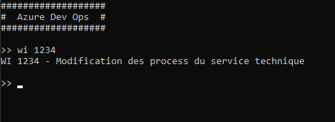

# ItsMyConsole.Tools.AzureDevOps

Outil Azure DevOps (Création/Modification WorkItem) pour le Framework [```ItsMyConsole```](https://github.com/dtarroz/ItsMyConsole)

## Sommaire

- [Pourquoi faire ?](#pourquoi-faire-)
- [Getting Started](#getting-started)
- [Comment se servir de l'outil ?](#comment-se-servir-de-loutil-)
- [Ajout d'une configuration serveur Azure DevOps](#ajout-dune-configuration-serveur-azure-devops)
- [Création d'un WorkItem](#création-dun-workitem)
- [Modification d'un WorkItem](#modification-dun-workitem)
- [Récupération des informations d'un WorkItem](#récupération-des-informations-dun-workitem)
- [Suppression d'un WorkItem](#suppression-dun-workitem)
- [Ajout d'une relation entre WorkItems](#ajout-dune-relation-entre-workitems)
- [Récupération de l'itération courante d'un projet](#récupération-de-litération-courante-dun-projet)
- [Récupération du nom de la configuration Azure DevOps](#récupération-du-nom-de-la-configuration-azure-devops)
  
## Pourquoi faire ?

Vous allez pouvoir étendre le Framework pour application Console .Net [```ItsMyConsole```](https://github.com/dtarroz/ItsMyConsole) avec un outil de manipulation des WorkItems d'Azure DevOps.

L'outil ```ItsMyConsole.Tools.AzureDevOps``` met à disposition :
 - La création de WorkItem
 - La modification de WorkItem
 - La récupération des informations d'un WorkItem
 - La suppression d'un WorkItem
 - L'ajout de relations entre les WorkItems
 - L'itération courante pour un projet

## Getting Started

1. Créer un projet **"Application Console .Net"** avec le nom *"MyExampleConsole"*
2. Ajouter [```ItsMyConsole```](https://github.com/dtarroz/ItsMyConsole) au projet depuis le gestionnaire de package NuGet
3. Ajouter ```ItsMyConsole.Tools.AzureDevOps``` au projet depuis le gestionnaire de package NuGet
4. Aller sur le site web de votre serveur Azure DevOps
5. Cliquer sur l'icône de votre profil, puis **"Sécurité"**
6. Créer un nouveau jeton d'accès personnel, [exemple de procédure ici](https://docs.microsoft.com/fr-fr/azure/devops/organizations/accounts/use-personal-access-tokens-to-authenticate?view=azure-devops&tabs=preview-page#create-a-pat), et **faite une sauvegarde de la valeur**
5. Dans le projet, modifier la méthode **"Main"** dans le fichier **"Program.cs"** par le code suivant :
```cs
using ItsMyConsole;
using ItsMyConsole.Tools.AzureDevOps;
using System;
using System.Threading.Tasks;

namespace MyExampleConsole
{
    class Program
    {
        static async Task Main() 
        {
            ConsoleCommandLineInterpreter ccli = new ConsoleCommandLineInterpreter();

            // Console configuration
            ccli.Configure(options => {
                options.Prompt = ">> ";
                options.LineBreakBetweenCommands = true;
                options.HeaderText = "##################\n#  Azure DevOps  #\n##################\n";
                options.TrimCommand = true;
            });

            // Azure DevOps configuration
            ccli.AddAzureDevOpsServer(new AzureDevOpsServer {
                Name = "TEST",
                Url = "https://<SERVEUR>",
                PersonalAccessToken = "<TOKEN>"
            });

            // Display the title of the workitem
            // Example : wi 1234
            ccli.AddCommand("^wi [0-9]*$", async tools => {
                int workItemId = Convert.ToInt32(tools.CommandArgs[1]);
                WorkItem workItem = await tools.AzureDevOps("TEST").GetWorkItemAsync(workItemId);
                Console.WriteLine($"WI {workItemId} - {workItem.Title}");
            });

            await ccli.RunAsync();
        }
    }
}
```

Voici le résultat attendu lors de l'utilisation de la Console :

 

Dans cet exemple de code on a configuré avec ```Configure```, le prompt d’attente des commandes ```options.Prompt```, la présence d'un saut de ligne entre les saisies ```options.LineBreakBetweenCommands``` et l’en-tête affichée au lancement ```options.HeaderText```. 

On ajoute la configuration du serveur Azure DevOps avec ```AddAzureDevOpsServer``` et on lui renseigne un nom ```Name``` qui permet de différentier si on configure plusieurs serveurs, l'url d'Azure DevOps ```Url``` et le jeton d'accès personnel ```PersonalAccessToken```.

Puis avec ```AddCommand```, on a ajouté un pattern d’interprétation des lignes de commande ```^wi [0-9]*$``` *(commence par **"wi"** et suivi d'un nombre)*.

Lors de l'exécution de la Console, si on saisit une commande qui commence par **"wi"** avec un nombre à la suite, il lancera l'implémentation de l'action associée. Dans cet exemple, il récupère l'identifiant du WorkItem en utilisant ```tools.CommandArgs``` depuis les outils disponibles *(tableau des arguments de la ligne de commande)* pour lui permet de récupérer les informations du WorkItem associé avec ```tools.AzureDevOps("TEST").GetWorkItemAsync``` *(ici "TEST" c'est le nom donné à la configuration du serveur)*. Avec les informations récupérées, il affiche son titre dans la Console.

Maintenant que l'on a configuré la Console et l'implémentation de l'action associée au pattern ```^wi [0-9]*$```, l'utilisation de ```RunAsync``` lance la mise en attente d'une saisie de commande par l'utilisateur.

## Comment se servir de l'outil ?

Tout d'abord, vous devez ajouter une configuration serveur Azure DevOps avec ```AddAzureDevOpsServer```et définir un nom ```Name```.
Vous pouvez ensuite accéder à l'outil Azure DevOps lorsque vous ajoutez une interprétation de commande avec ```AddCommand```.  
Le nom défini lors de la configuration permet de cibler le serveur lors de l'utilisation de l'outil.

```cs
ConsoleCommandLineInterpreter ccli = new ConsoleCommandLineInterpreter();

// Azure DevOps configuration
ccli.AddAzureDevOpsServer(new AzureDevOpsServer {/*  */});

// Add command
ccli.AddCommand("<PATTERN>", async tools => 
{
    WorkItem example = await tools.AzureDevOps("<NAME>").GetWorkItemAsync(1234);
});
```

Vous devez ajouter ```using ItsMyConsole.Tools.AzureDevOps;``` pour avoir accès a l'outil Azure DevOps depuis ```tools``` de ```AddCommand```.

## Ajout d'une configuration serveur Azure DevOps

Vous pouvez ajouter une configuration d'un serveur Azure DevOps en utilisant ```AddAzureDevOpsServer```.

| Propriété | Description |
| :-------- | :---------- |
| Name | Nom unique du serveur Azure DevOps qui sert de désignation lors de son utilisation |
| Url | L'URL du serveur Azure DevOps |
| PersonalAccessToken | Le token d'accès personnel au serveur Azure DevOps. Vous devez le créer depuis votre site web d'Azure DevOps. [Exemple de procédure ici](https://docs.microsoft.com/fr-fr/azure/devops/organizations/accounts/use-personal-access-tokens-to-authenticate?view=azure-devops&tabs=preview-page#create-a-pat) |

```cs
ConsoleCommandLineInterpreter ccli = new ConsoleCommandLineInterpreter();

// Azure DevOps configuration
ccli.AddAzureDevOpsServer(new AzureDevOpsServer {
    Name = "TEST",
    Url = "https://<SERVEUR>",
    PersonalAccessToken = "<TOKEN>"
});
```

Si vous avez plusieurs serveurs Azure DevOps, le nom ```Name``` permet de cibler celui que vous voulez lors de la manipulation des WorkItems.

## Création d'un WorkItem

Vous pouvez créer des WorkItems en utilisant ```CreateWorkItemAsync```.

| Propriété | Description |
| :-------- | :---------- |
| workItemFields | La liste des champs à renseigner lors de la création du WorkItem |

```cs
ccli.AddCommand("<PATTERN>", async tools => 
{
    WorkItem newWorkItem = await tools.AzureDevOps("<NAME>")
                                      .CreateWorkItemAsync(new WorkItemCreateFields {
                                          // Insert yours fields here
                                      });
});
```

Vous pouvez modifier les champs suivants :

| Nom du champ | Description |
| :----------- | :---------- |
| AreaPath | La zone du WorkItem |
| TeamProject |  *(obligatoire)* Le projet du WorkItem |
| IterationPath | L'itération du WorkItem |
| Title | Le titre du WorkItem |
| State | L'état du WorkItem |
| WorkItemType | *(obligatoire)* Le type du WorkItem |
| AssignedToDisplayName | Le nom de la personne à assigner au WorkItem |
| Activity | Activité du WorkItem |
| Description | La description du WorkItem |
| ReproSteps | Les étapes de reproduction du WorkItem |
| SystemInfo | Les informations systèmes du WorkItem |
| AcceptanceCriteria | Les critères d'acceptation du WorkItem |
| Tags | Les balises du WorkItem |

Vous avez en retour un objet de type [```WorkItem```](#récupération-des-informations-dun-workitem).

## Modification d'un WorkItem

Vous pouvez modifier un WorkItem en utilisant ```UpdateWorkItemAsync```.

| Propriété | Description |
| :-------- | :---------- |
| workItemId | L'identifiant du WorkItem à mettre à jour |
| workItemFields | La liste des champs à mettre à jour sur le WorkItem. Tous les champs sont facultatifs, vous pouvez mettre à jour seulement ceux que vous voulez. |

```cs
ccli.AddCommand("<PATTERN>", async tools => 
{
    await tools.AzureDevOps("<NAME>").UpdateWorkItemAsync(1234, new WorkItemUpdateFields 
    {
        // Insert yours fields here
    });
});
```

Vous pouvez modifier les champs suivants :

| Nom du champ | Description |
| :----------- | :---------- |
| AreaPath | *(facultatif)* La zone du WorkItem |
| TeamProject | *(facultatif)* Le projet du WorkItem |
| IterationPath | *(facultatif)* L'itération du WorkItem |
| Title | *(facultatif)* Le titre du WorkItem |
| State | *(facultatif)* L'état du WorkItem |
| WorkItemType | *(facultatif)* Le type du WorkItem |
| AssignedToDisplayName | *(facultatif)* Le nom de la personne à assigner au WorkItem |
| Activity | *(facultatif)* L'activité du WorkItem |
| Description | *(facultatif)* La description du WorkItem |
| ReproSteps | *(facultatif)* Les étapes de reproduction du WorkItem |
| SystemInfo | *(facultatif)* Les informations systèmes du WorkItem |
| AcceptanceCriteria | *(facultatif)* Les critères d'acceptation du WorkItem |

Vous avez en retour un objet de type [```WorkItem```](#récupération-des-informations-dun-workitem).

## Récupération des informations d'un WorkItem

Vous pouvez récupérer les informations d'un WorkItem en utilisant ```GetWorkItemAsync```.

| Propriété | Description |
| :-------- | :---------- |
| workItemId | L'identifiant du WorkItem |

```cs
ccli.AddCommand("<PATTERN>", async tools => 
{
    WorkItem workItem = await tools.AzureDevOps("<NAME>").GetWorkItemAsync(1234);
});
```

Vous avez en retour un objet de type ```WorkItem```.

| Nom de la propriété | Description |
| :------------------ | :---------- |
| Id | L'identifiant du WorkItem |
| AreaPath | La zone du WorkItem |
| TeamProject | Le projet du WorkItem |
| IterationPath | L'itération du WorkItem |
| Title | Le titre du WorkItem |
| State | L'état du WorkItem |
| WorkItemType | Le type du WorkItem |
| AssignedToDisplayName | Le nom de la personne assignée au WorkItem |
| Activity | L'activité du WorkItem |
| Description | La description du WorkItem |
| ReproSteps | Les étapes de reproduction du WorkItem |
| SystemInfo | Les informations systèmes du WorkItem |
| AcceptanceCriteria | Les critères d'acceptation du WorkItem |
| Childs | La liste des identifiants des WorkItems enfants |
| Parent | L'identifiant du WorkItem parent |
| Related | La liste des identifiants des WorkItems associés |
| Tags | La liste des balises du WorkItem |

## Suppression d'un WorkItem

Vous pouvez supprimer un WorkItem en utilisant ```DeleteWorkItemAsync```.

| Propriété | Description |
| :-------- | :---------- |
| workItemId | L'identifiant du WorkItem |

```cs
ccli.AddCommand("<PATTERN>", async tools => 
{
    await tools.AzureDevOps("<NAME>").DeleteWorkItemAsync(1234);
});
```

## Ajout d'une relation entre WorkItems

Vous pouvez ajouter des relations entre WorkItems en utilisant ```AddWorkItemRelationAsync``` pour une seule relation et ```AddWorkItemRelationsAsync``` pour en ajouter plusieurs.

| Propriété | Description |
| :-------- | :---------- |
| workItemId | L'identifiant du WorkItem qui va recevoir la relation |
| workItemToAdd | Le ou les WorkItems à ajouter |
| linkType | Le type de lien entre le WorkItem est celui que l'on veut ajouter |

```cs
ccli.AddCommand("<PATTERN>", async tools => 
{
    WorkItem workItemToAdd = await tools.AzureDevOps("<NAME>").GetWorkItemAsync(5678);
    await tools.AzureDevOps("<NAME>").AddWorkItemRelationAsync(1234, workItemToAdd, LinkType.Child);
});
```
Vous avez en retour un objet de type [```WorkItem```](#récupération-des-informations-dun-workitem).

## Récupération de l'itération courante d'un projet

Vous pouvez récupérer l'itération courante d'un projet en utilisant ```GetCurrentTeamIterationAsync```.

| Propriété | Description |
| :-------- | :---------- |
| project | Le nom du projet |
| team | *(facultatif)* Le nom de l'équipe |

```cs
ccli.AddCommand("<PATTERN>", async tools => 
{
    TeamIteration teamsIteration = await tools.AzureDevOps("<NAME>").GetCurrentTeamIterationAsync("<PROJECT>");
});
```

Vous avez en retour un objet de type ```TeamIteration```.

| Nom de la propriété | Description |
| :------------------ | :---------- |
| Name | Le nom de l'itération |
| Path | Le chemin relatif de l'itération |
| StartDate | Date de début de l'itération |
| FinishDate | Date de fin de l'itération |

## Récupération du nom de la configuration Azure DevOps

Vous pouvez récupérer le nom de la configuration Azure DevOps en utilisant ```GetAzureDevOpsServerName```.

```cs
ccli.AddCommand("<PATTERN>", async tools => 
{
    string serverName = tools.AzureDevOps("<NAME>").GetAzureDevOpsServerName();
});
```
